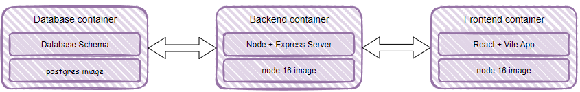

# COSC349-A1

### By Leon Chen & Glen Garcia


We are developing a versatile, and user-friendly to-do list web application named To-doey. This application operates on three foundational Docker containers, each handling a specific task. The frontend container enables users to interact with the application, using React + Vite, such as creating to-do tasks. The backend container, built with Node.js and Express.js, manages the REST API. Lastly, the PostgreSQL database container stores user information and task data in a structured schema.

Required Dependencies:

- Docker

Initialization:

`git clone` the repository to a directory, and `cd COSC349-A1` to move into the repository.

Ensure the docker engine is running in order to build the necessary images.

Open a terminal at the repository directory, and run 
```
docker-compose up
```
After completion of the automated build process (by checking docker desktop containers or terminal), navigate to `http://localhost:5173` in a web browser to access the web application.

For subsequent redeployments:

In order to rebuild the three container images after making changes to the application code, enter:
```
docker-compose build
```
or
```
docker-compose up --build
```
to automatically start up after building.

To stop and delete the containers:
```
docker-compose down
```

### Frontend Container:
This container provides the user interface for the To-doey web application, allowing the users to interact with the application by creating, and managing their to-do tasks.

Technology: React + Vite

Exposes `5173` to access the frontend. Type `http://localhost:5173` at a web browser to access the user interface.

### Backend Container
This container serves as the API server for the To-doey web app. This handles requests from the frontend and interactions with the database.

Technology: Node.js, Express.js

Exposes port `3000` to access the backend. `http://localhost:3000` is used to communicate with the backend. 

### Database Container
This container hosts the PostgreSQL databse which stores user info and their task data in a structured schema. Allowing for data persistence and easy querying.

Technology: PostgreSQL

You can connect to the database in the postgres docker terminal with the command: `psql -U root -d test_db`

Architecture:
